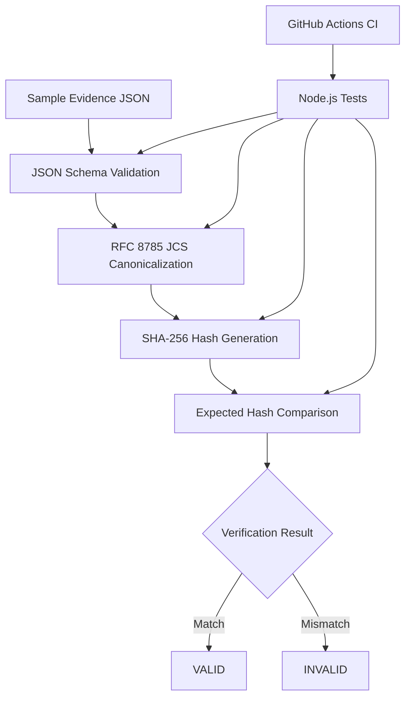
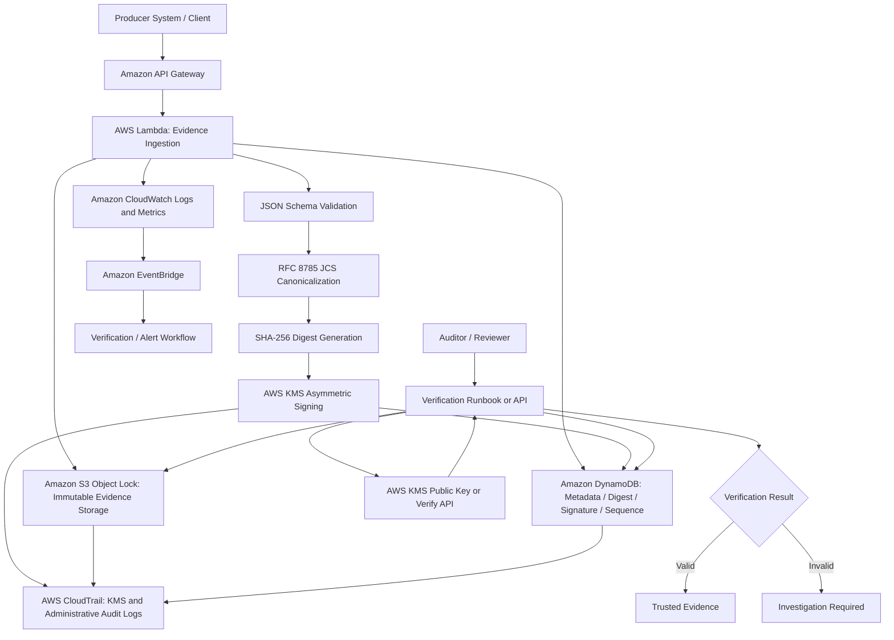
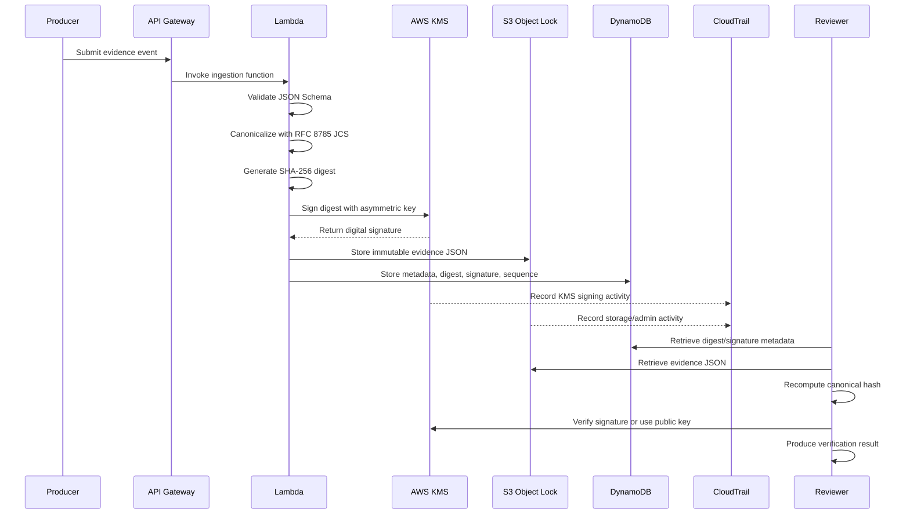

# Architecture Diagram

This document provides a high-level visual overview of the Tanden Trust Audit PoC.

The project has two architectural layers:

1. **Local MVP Architecture**  
   A reproducible local workflow for validating, canonicalizing, hashing, and verifying evidence records.

2. **Production-oriented AWS Architecture**  
   A hardened reference architecture that extends the local MVP with asymmetric signing, immutable storage, audit logging, and operational controls.

---

## 1. Local MVP Architecture

The local MVP focuses on deterministic and reproducible verification.

### Local MVP responsibilities

| Component | Responsibility |
|---|---|
| Sample Evidence JSON | Provides reproducible demo evidence |
| JSON Schema Validation | Confirms structural correctness |
| RFC 8785 JCS Canonicalization | Produces deterministic JSON input for hashing |
| SHA-256 Hash Generation | Calculates evidence digest |
| Expected Hash Comparison | Detects content tampering |
| Node.js Tests | Prevents regression |
| GitHub Actions CI | Runs verification automatically on pull requests and main updates |

### Local MVP limitations

The local MVP does not fully prove:

- who produced the evidence
- who approved or protected the expected hash
- whether evidence records were deleted, reordered, or omitted
- whether the timestamp came from a trusted source
- whether the evidence was stored immutably

These limitations are addressed in the production-oriented AWS design.

---

## 2. Production-oriented AWS Architecture

The production-oriented design extends the local hash-based workflow with AWS-native security and audit controls.

### Production-oriented responsibilities

| Component | Responsibility |
|---|---|
| API Gateway | Receives evidence ingestion requests |
| Lambda | Validates, canonicalizes, hashes, and coordinates signing/storage |
| JSON Schema | Enforces expected evidence structure |
| RFC 8785 JCS | Produces deterministic digest input |
| SHA-256 Digest | Provides content integrity baseline |
| AWS KMS Asymmetric Signing | Adds authenticity and stronger non-repudiation support |
| S3 Object Lock | Stores evidence in immutable WORM-style storage |
| DynamoDB | Stores metadata, digest, signature, sequence, and verification state |
| CloudTrail | Records KMS, storage, and administrative activities |
| CloudWatch | Provides logs, metrics, and operational visibility |
| EventBridge | Triggers verification workflows and alerts |
| Verification Runbook/API | Enables auditors to reproduce verification steps |

---

## 3. Security Property Mapping

| Security property | Local MVP | Production-oriented AWS design |
|---|---|---|
| Structural correctness | JSON Schema | JSON Schema |
| Deterministic representation | RFC 8785 JCS | RFC 8785 JCS |
| Content integrity | SHA-256 hash | SHA-256 hash |
| Authenticity | Not fully proven | AWS KMS asymmetric signing |
| Non-repudiation support | Limited | KMS signing, IAM controls, CloudTrail |
| Expected hash protection | Manual/local assumption | Signed digest and controlled metadata storage |
| Immutability | Not included | S3 Object Lock |
| Ordering and completeness | Not included | DynamoDB sequence + hash chain roadmap |
| Audit logging | Local output / CI logs | CloudTrail, CloudWatch, EventBridge |
| Operational repeatability | npm scripts and tests | Runbooks, CI, monitoring, verification workflows |

---

## 4. Evidence Lifecycle

---

## 5. Intended Completion Boundary

This architecture intentionally separates:

- **implemented local MVP**
  - schema validation
  - canonicalization
  - SHA-256 hashing
  - verification scripts
  - automated tests
  - CI

- **production-oriented security design**
  - KMS asymmetric signing
  - S3 Object Lock
  - DynamoDB metadata model
  - CloudTrail / CloudWatch / EventBridge
  - sequence and hash-chain roadmap

This project does not currently aim to provide a complete production SaaS, legal compliance certification, or full AWS deployment.
