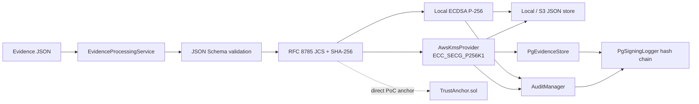
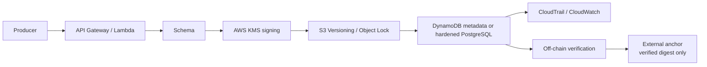

# Architecture Diagram

## Current Implementation

```mermaid
flowchart LR
    E[Evidence JSON] --> PS[EvidenceProcessingService]
    PS --> V[JSON Schema validation]
    V --> C[RFC 8785 JCS + SHA-256]
    C --> LS[Local ECDSA P-256]
    C --> KS[AwsKmsProvider<br/>ECC_SECG_P256K1]
    LS --> ST[Local / S3 JSON store]
    KS --> ST
    KS --> PG[PgEvidenceStore]
    PG --> PL
    LS --> AM[AuditManager]
    KS --> AM
    AM --> PL[PgSigningLogger hash chain]
    C -. direct PoC anchor .-> WA[TrustAnchor.sol]
```

実線は実装済みmoduleの責務を示しますが、deploy済みという意味ではありません。`EvidenceProcessingService`はSchema、signing provider、`PgEvidenceStore`互換Store、`PgSigningLogger`互換Ledgerを順番に呼ぶapplication APIです。`AuditManager`は従来どおりproviderと`PgSigningLogger`のみを接続します。点線のWeb3 PoCはdigestを直接anchorし、署名済みであることをContractが検証しません。

S3 unit/E2E testはfake clientを使い、実AWS S3 integration testはcredentialsと環境変数を必要とする別suiteです。AWS KMS unit testもinjected mock clientを使います。PostgreSQL moduleのunit testはfake pool/clientを使います。

## Target / Reference Architecture

```mermaid
flowchart LR
    P[Producer] --> API[API Gateway / Lambda]
    API --> SC[Schema]
    SC --> KMS[AWS KMS signing]
    KMS --> S3[S3 Versioning / Object Lock]
    S3 --> DB[DynamoDB metadata or hardened PostgreSQL]
    DB --> CT[CloudTrail / CloudWatch]
    DB --> VF[Off-chain verification]
    VF --> AN[External anchor<br/>verified digest only]
```

この図はproduction-oriented targetであり未deployです。DynamoDBはtarget/alternative metadata architecture、S3 Object Lock、IAM/KMS policy、CloudTrail correlation、API/Lambda/EventBridge、verified anchoring flowはplannedです。

## Security Property Comparison

| Property | Current PoC | Target / Reference |
|---|---|---|
| Structural validation | `EvidenceProcessingService`では署名前にfail-closedで強制。既存低レベルentry pointは個別利用可能 | ingestion serviceでfail-closedに強制 |
| Authenticity | local providerとAwsKmsProvider実装済み | least-privilege IAM、key policy、separation of duties込み |
| Storage | local/S3 adapter、PostgreSQL store実装済み | S3 Object Lock、retention、HA/backup |
| Ledger | PostgreSQL hash chain実装済み | hardened DB rolesとexternal chain-head anchoring |
| AWS audit | SDK callsは実装済み。CloudTrail構成はRepository外 | CloudTrail retention、correlation、alarm |
| Web3 | unsigned/unverifiedでもdigestを直接anchor可能 | verified digest/verification dataだけをanchor |
